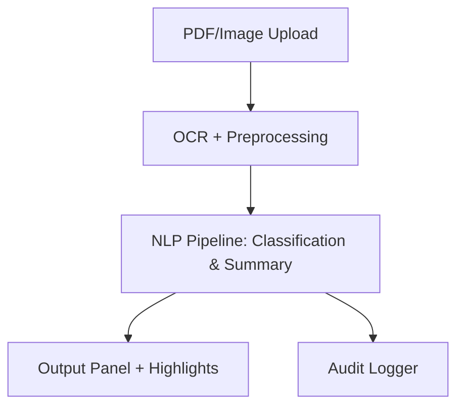

# ⚖️ LexGuardian — The Smartest Legal Document Analyzer

LexGuardian is a modern AI-powered assistant designed to help individuals, startups, and professionals quickly **understand, summarize, and flag important elements in legal documents**. From NDAs to contracts and leases, LexGuardian simplifies the complex, saving hours of manual review and minimizing legal risk.

> 🧠 Decode legalese. See the big picture. Trust your documents.

---

## 🚀 What Makes LexGuardian Different?

- 🧩 **Modular**: Adaptable pipelines for different document types
- 👁️ **Transparent**: Each output is traceable and auditable
- 📊 **Explainable**: Highlights what’s detected and why it matters
- 📄 **PDF + Image Support**: Handles scanned docs, contracts, and forms
- 💼 **Startup-Friendly**: Light, customizable, no enterprise bloat
- 🔐 **Trust-by-Design**: Optional audit metadata with each analysis

---

## 💡 Features

- **Clause Classification**  
  Detects clauses like Confidentiality, Termination, Indemnity, etc.

- **Red Flag Detection**  
  Identifies risky or unusual contract terms using classification and pattern recognition.

- **Summarization**  
  Provides plain-English summaries of long legal sections.

- **Ask Your Document**  
  Query uploaded files with natural questions like “When does this agreement end?”

- **Smart Audit Logs**  
  Tracks model interactions, timestamps, and document trace data.

---

## 🏗️ System Flow



Built with:

- `FastAPI` for backend APIs
- `Transformers`, `spaCy`, `pdfplumber`, `layoutparser` for NLP and OCR
- `React.js` for frontend dashboards
- `Docker` + GitHub Actions for deployment

---

## 📦 Who Uses LexGuardian?

- ⚙️ Startup founders validating investor or vendor agreements
- 📚 Law clinics & student teams triaging legal files
- 🏢 Internal teams reviewing compliance or contracts
- 🤝 NGOs/legal aid reviewing property and employment forms
- 🧑‍💻 Researchers experimenting with legal document NLP

---

## ⚡ Quickstart

### Backend

```bash
pip install -r requirements.txt
uvicorn backend.server.main:app --reload
```

### Frontend

```bash
cd frontend
npm install
npm start
```

### Or Run with Docker

```bash
docker-compose up --build
```

---

## 🔐 Configuration

```bash
cp backend/config/secrets.env.example backend/config/.env
```

---

## 📄 Sample Documents

Available in `data/samples/`:

- `nda.pdf`
- `vendor-contract.pdf`
- `lease-agreement.pdf`

---

## 🌐 API Summary

```http
POST /agent/upload     → Upload PDF or image
POST /agent/qa         → Ask questions from document
GET  /admin/logs       → View audit logs (admin-only)
```

See [`docs/api-guide.md`](docs/api-guide.md) for full reference.

---

## 🛠 Roadmap

- [x] Clause classification + QA pipeline
- [x] Red flag clause detection
- [x] Audit logging
- [x] Full web UI
- [ ] Plugin system for new clause types
- [ ] Chrome extension
- [ ] Document comparison tools

---

## 💬 Why LexGuardian?

Other tools automate the legal process.
LexGuardian augments your legal reasoning — making AI explainable, accessible, and verifiable.

> One upload. Total clarity.

---

## 📜 License

[MIT License](LICENSE)

---

## 🧠 Feedback & Collaboration

We’re open to contributors and ideas — feel free to open issues or start discussions.
We're not just building a tool — we’re building **trust in intelligence**.
